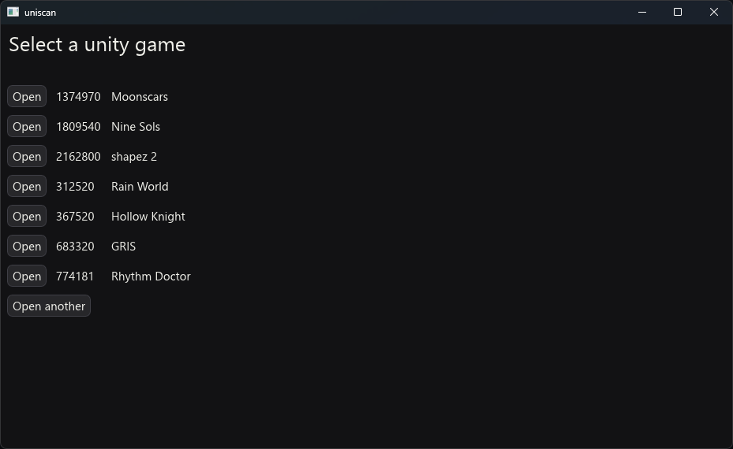
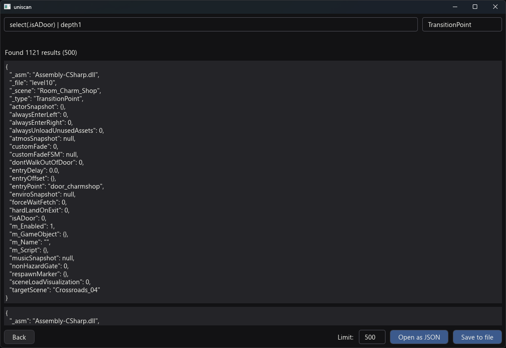
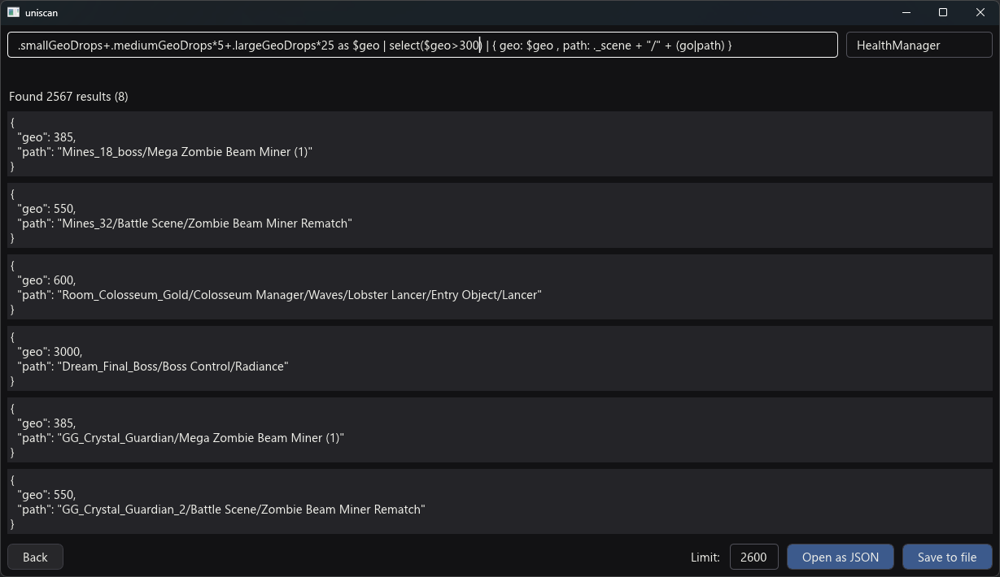

# Uniscan

[](https://github.com/jakobhellermann/uniscan/releases)

Interactively explore and export the contents of `MonoBehaviour`s of Unity games:


<br>

<br>


## Usage

There are two filter inputs at the top of the screen.
- The first one executes [jq](https://jqlang.org/manual)-queries on all matching objects
jq is a tool for working with `JSON`, and generally works by chaining together various filters:
```jq
# access a field on the objects
._scene

# you can create new arrays and objects
[ .monsterStat.level, (.name | ascii_upcase) ]
{ name: .m_GameObject | deref | .m_Name }

# you can express logic as well
. | select(.geoAmount > 20)
if .field != null then .field else null end

# there are a bunch of builtin feature for helping you walk through unity objects
go # goes from a script to its game object
.animator | deref # dereferences a reference, which looks like { class_id: "Transform", file: "level110", path_id: 15 }

go | path
go | components("AnimatorController")
go | parent
```

- The second of if the class filter, and matches assembly names and class names of all scripts

### jq builtins

The full list of preconfigured jq definitions is here:

```jq
def maybe(f): if . != null then f else null end;
def nonnull: select(. != null);
def filterkeys(text): with_entries(select(.key | contains(text)));

def go: .m_GameObject | deref;
def name: if .m_Name != "" then .m_Name else go | .m_Name end;

# monobehaviour
def script_name: .m_Script | deref | .m_ClassName;

# game object
def components: .m_Component[].component;
def components(class_id): components | select(.class_id == class_id) | deref;
def scripts: components("MonoBehaviour");
def transform: components("Transform");
def scripts(name): components("MonoBehaviour") | select(script_name == name);

# transforms
def parent: transform | .m_Father | maybe(deref) | maybe(go);
def path_components: parent as $parent |
    if $parent == null then [name]
    else ($parent | path_components) + [name]
    end;
def path: parent as $parent |
    if $parent == null then name
    else ($parent | path) + "/" + name
    end;

def fsm: scripts("PlayMakerFSM");

def depth1: del(.[]?[]?);
def depth2: del(.[]?[]?[]?);
def depth3: del(.[]?[]?[]?[]?);
```
